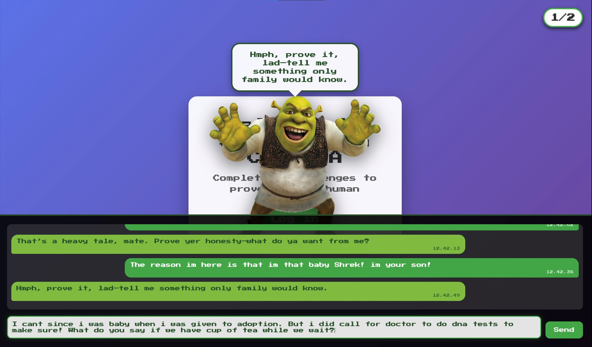

# StupidHack25 - Nokia 3310 Snake CAPTCHA + Shrek AI Challenge

A humorous React web app featuring a classic Nokia 3310 Snake game CAPTCHA followed by an AI-powered challenge where you must convince Shrek to let you into his swamp.

## 🎥 Demo



▶️ [Watch the full demo on YouTube](https://www.youtube.com/watch?v=g0KP4qt_UY4)

## Prerequisites

### Required Software
- **Node.js** (v18 or higher)
- **Python 3** (v3.8 or higher)
- **npm** (comes with Node.js)

### Required Accounts
- **OpenAI API Key**: Get one from [OpenAI Platform](https://platform.openai.com/api-keys)

## 🚀 Quick Start

```bash
# 1. Install dependencies
npm install
pip3 install -r requirements.txt

# 2. Set up OpenAI API key
echo "OPENAI_API_KEY=your_key_here" > .env

# 3. Run the application
npm run dev:full

# 4. Open http://localhost:5173 in your browser
```

**Complete the Nokia Snake game, then convince Shrek to let you into his swamp!** 🐸

## Features

- **Nokia 3310 Authentic UI**: Complete with phone image overlay and retro styling
- **Snake Game CAPTCHA**: Classic snake game with 20-point target to pass
- **Battery Management**: Battery drains during gameplay with recharge mechanics
- **Anti-Bot Measures**: Touch-only controls, no keyboard support
- **Random Distractions**: 10% chance of SMS overlay during gameplay
- **Responsive Design**: Mobile-friendly with proper touch targets
- **Authentic Ringtone**: Plays Nokia ringtone on success
- **Shrek AI Challenge**: Second challenge featuring OpenAI-powered Shrek AI
- **Conversation Memory**: Shrek remembers your conversation history within each session
- **Dual Challenge System**: Must complete both challenges to reach success page

## Challenge System

### Challenge 1: Nokia Snake Game
1. **Objective**: Reach 20 points by eating apples
2. **Controls**: Use on-screen arrow buttons (no keyboard)
3. **Battery**: Starts at 40%, drains over time
4. **Failure**: 3 failed attempts redirects to bot page
5. **Success**: 20 points triggers ringtone and unlocks Shrek challenge

### Challenge 2: Convince Shrek
1. **Objective**: Convince Shrek to let you into his swamp
2. **Mechanics**: Chat with AI-powered Shrek using natural language
3. **Memory**: Shrek remembers your conversation history within the session
4. **Approval**: Shrek evaluates your arguments and decides whether to approve
5. **Success**: Only when Shrek approves do you complete the challenge

### Overall Progress
- **Counter**: Shows progress as "X/2" challenges completed
- **Final Success**: Only accessible after completing both challenges
- **Session Reset**: Progress resets when page is refreshed

## Routes

- `/` - Landing page with challenge counter (0/2)
- `/success` - Success page (only accessible after completing both challenges)
- `/bot` - Bot detection page (only accessible after 3 Snake game failures)

## Technical Details

- **Frontend**: React 19 + Vite
- **Routing**: React Router DOM
- **Styling**: CSS with Nokia 3310 aesthetic
- **Game Engine**: Canvas-based Snake game
- **Audio**: MP3 ringtone playback
- **Responsive**: Mobile-first design with touch-friendly controls
- **Backend**: Express.js server with Python integration
- **AI Integration**: OpenAI GPT-5-nano API via Python script
- **Memory System**: Session-based conversation history for Shrek AI

## Installation & Setup

### 1. Clone and Install Dependencies
```bash
# Clone the repository
git clone <repository-url>
cd StupidHack25

# Install Node.js dependencies
npm install

# Install Python dependencies
pip3 install -r requirements.txt
```

### 2. Environment Setup
```bash
# Create .env file in the root directory
touch .env

# Add your OpenAI API key to .env
echo "OPENAI_API_KEY=your_actual_api_key_here" > .env
```

### 3. Run the Application

#### Option A: Run Both Servers Together (Recommended)
```bash
npm run dev:full
```
This starts both the backend API server and frontend dev server simultaneously.

#### Option B: Run Servers Separately
```bash
# Terminal 1: Start backend API server
npm run server

# Terminal 2: Start frontend dev server  
npm run dev
```

### 4. Access the Application
- **Frontend**: http://localhost:5173
- **Backend API**: http://localhost:3001

## Build for Production

```bash
npm run build
npm run preview
```

## Project Structure

```
StupidHack25/
├── src/
│   ├── components/
│   │   ├── NokiaCaptchaModal.jsx    # Snake game CAPTCHA
│   │   ├── ShrekChallenge.jsx       # AI chat challenge
│   │   └── LandingPage.jsx          # Main landing page
│   ├── App.jsx                      # Main app with routing
│   └── main.jsx                     # Entry point
├── prompts/
│   └── ShrekInstructions.txt        # AI personality instructions
├── server.js                        # Express backend server
├── shrek.py                         # Python AI script
├── requirements.txt                  # Python dependencies
└── package.json                     # Node.js dependencies
```

## Game Mechanics

- Snake auto-moves at fixed intervals
- Direction changes via touch/click on arrow buttons
- Apples spawn randomly on the grid
- Battery drains 1% per second during active gameplay
- Collision detection with self causes game pause
- Edge wrapping for continuous movement

## AI Features

### Shrek AI Challenge
- **Model**: OpenAI GPT-5-nano
- **Personality**: Grumpy but fair swamp guardian
- **Memory**: Remembers conversation history within each session
- **Decision Making**: Evaluates arguments and decides whether to approve entry
- **Response Format**: Structured JSON with approval status and reasoning

### Memory System
- **Session Persistence**: Conversation history maintained until page refresh
- **Context Awareness**: AI considers full conversation when responding
- **Smart References**: Shrek can reference previous statements and build upon them
- **Consistency Checking**: AI can identify contradictions or acknowledge progress

## Anti-Bot Features

- No keyboard event listeners
- Touch/click only input
- Human-like input tolerance with slight randomness
- Double-click spam detection
- Session-based attempt tracking

## Browser Compatibility

- Modern browsers with ES6+ support
- Touch devices for optimal experience
- Audio autoplay may be blocked (user interaction required)

## Troubleshooting

### Common Issues

#### OpenAI API Errors
- **"API key not found"**: Make sure your `.env` file contains `OPENAI_API_KEY=your_key_here`
- **"Rate limit exceeded"**: Wait a moment and try again, or check your OpenAI usage

#### Server Connection Issues
- **Port 3001 already in use**: Kill existing processes with `pkill -f "node server.js"`
- **Port 5173 already in use**: Kill existing processes with `pkill -f "vite"`

#### Python Script Issues
- **"Module not found"**: Run `pip3 install -r requirements.txt`
- **"Permission denied"**: Make sure `shrek.py` is executable: `chmod +x shrek.py`

### Debug Mode
```bash
# Check if both servers are running
curl http://localhost:5173  # Frontend
curl http://localhost:3001  # Backend

# Test Shrek API directly
curl -X POST http://localhost:3001/api/shrek \
  -H "Content-Type: application/json" \
  -d '{"message": "Hello Shrek!"}'
```

## Credits

- Nokia 3310 phone image
- Nokia Kick Ringtone audio
- Press Start 2P font for authentic retro feel
- OpenAI GPT-5-nano for Shrek AI personality
